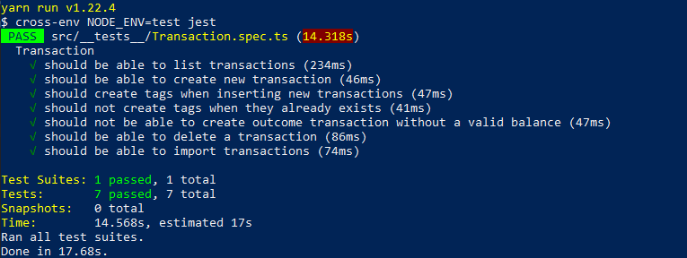

<p align="center">


<a href="https://www.linkedin.com/in/alquiponeto/">
    
</a>

<a href="https://github.com/Alquipo/GoStack12-desafio-06/commits/master">
    
</a>


</p>

<p align="center">

<a target="_blank" href="https://nodejs.org/">
    
  </a>

</p>
<h2 align="center">
  Desafio 06: Banco de dados e upload de arquivos no Node.js
</h2>

## 🚀 Sobre o desafio

Nesse desafio, continuei desenvolvendo a aplicação de gestão de transações, treinando o que aprendi até agora no Node.js junto ao TypeScript, mas dessa vez incluindo o uso de banco de dados com o TypeORM e envio de arquivos com o Multer!

Essa será uma aplicação que deve armazenar transações financeiras de entrada e saída e permitir o cadastro e a listagem dessas transações, além de permitir a criação de novos registros no banco de dados a partir do envio de um arquivo csv.

<p align="center">

  
</p>

## 🔨 Tecnologias:

- [NodeJs][nodejs]
- [Express][express]
- [uuidv4][uuidv4]
- [Postgres][Postgres]
- [Multer][Multer]


## 🚀 Como rodar este projeto

Para clonar e executar este aplicativo, você precisará de [Git](https://git-scm.com), [NodeJs][nodejs] Instalado em seu computador.

### 🌀 Clonando o repositório

```bash
# Clone este repositório
$ git clone https://github.com/Alquipo/GoStack12-desafio-06

# Acesse a pasta do projeto no terminal/cmd
$ cd GoStack12-desafio-06
```

### 🎲 Rodando a API

```bash
# Instale as dependências
$ yarn

# Execute a Aplicação
$ yarn dev:server

# Execute o teste da Aplicação
$ yarn test

# O servidor inciará na porta:3333 - acesse http://localhost:3333
```

## 🔑 Rotas da aplicação

- **`POST /transactions`**: A rota deve receber `title`, `value`, `type`, e `category` dentro do corpo da requisição, sendo o `type` o tipo da transação, que deve ser `income` para entradas (depósitos) e `outcome` para saídas (retiradas). Ao cadastrar uma nova transação, ela deve ser armazenada dentro do seu banco de dados, possuindo os campos `id`, `title`, `value`, `type`, `category_id`, `created_at`, `updated_at`.

```json
{
  "id": "uuid",
  "title": "Salário",
  "value": 3000,
  "type": "income",
  "category": "Alimentação"
}
```

- **`GET /transactions`**: Essa rota deve retornar uma listagem com todas as transações que você cadastrou até agora, junto com o valor da soma de entradas, retiradas e total de crédito. Essa rota deve retornar um objeto o seguinte formato:

```json
{
  "transactions": [
    {
      "id": "uuid",
      "title": "Salário",
      "value": 4000,
      "type": "income",
      "category": {
        "id": "uuid",
        "title": "Salary",
        "created_at": "2020-04-20T00:00:49.620Z",
        "updated_at": "2020-04-20T00:00:49.620Z"
      },
      "created_at": "2020-04-20T00:00:49.620Z",
      "updated_at": "2020-04-20T00:00:49.620Z"
    },
    {
      "id": "uuid",
      "title": "Freela",
      "value": 2000,
      "type": "income",
      "category": {
        "id": "uuid",
        "title": "Others",
        "created_at": "2020-04-20T00:00:49.620Z",
        "updated_at": "2020-04-20T00:00:49.620Z"
      },
      "created_at": "2020-04-20T00:00:49.620Z",
      "updated_at": "2020-04-20T00:00:49.620Z"
    },
    {
      "id": "uuid",
      "title": "Pagamento da fatura",
      "value": 4000,
      "type": "outcome",
      "category": {
        "id": "uuid",
        "title": "Others",
        "created_at": "2020-04-20T00:00:49.620Z",
        "updated_at": "2020-04-20T00:00:49.620Z"
      },
      "created_at": "2020-04-20T00:00:49.620Z",
      "updated_at": "2020-04-20T00:00:49.620Z"
    },
    {
      "id": "uuid",
      "title": "Cadeira Gamer",
      "value": 1200,
      "type": "outcome",
      "category": {
        "id": "uuid",
        "title": "Recreation",
        "created_at": "2020-04-20T00:00:49.620Z",
        "updated_at": "2020-04-20T00:00:49.620Z"
      },
      "created_at": "2020-04-20T00:00:49.620Z",
      "updated_at": "2020-04-20T00:00:49.620Z"
    }
  ],
  "balance": {
    "income": 6000,
    "outcome": 5200,
    "total": 800
  }
}
```

- **`DELETE /transactions/:id`**: A rota deve deletar uma transação com o `id` presente nos parâmetros da rota;

* **`POST /transactions/import`**: A rota deve permitir a importação de um arquivo com formato `.csv` contendo as mesmas informações necessárias para criação de uma transação `id`, `title`, `value`, `type`, `category_id`, `created_at`, `updated_at`, onde cada linha do arquivo CSV deve ser um novo registro para o banco de dados, e por fim retorne todas as `transactions` que foram importadas para seu banco de dados. O arquivo csv, deve seguir o seguinte [modelo](.github/file.csv)

## 🤔 Como contribuir para o projeto

- Faça um **fork** do projeto;
- Crie uma nova branch com as suas alterações: `git checkout -b my-feature`
- Salve as alterações e crie uma mensagem de commit contando o que você fez:`git commit -m "feature: My new feature"`
- Envie as suas alterações: `git push origin my-feature`

> Caso tenha alguma dúvida confira este [guia de como contribuir no GitHub](https://github.com/firstcontributions/first-contributions)

## 📝 Licença

Este projeto esta sobe a licença MIT. Veja a [LICENÇA][license] para saber mais.

Feito com ❤️ por Alquipo Neto 👋🏽 [Entre em contato!](https://www.linkedin.com/in/alquiponeto/)

[nodejs]: https://nodejs.org/
[express]: https://expressjs.com/
[uuidv4]: https://www.npmjs.com/package/uuidv4
[nodemon]: https://www.npmjs.com/package/nodemon
[rs]: https://rocketseat.com.br
[license]: https://opensource.org/licenses/MIT
[Postgres]: https://www.postgresql.org/
[Multer]: https://www.npmjs.com/package/multer
